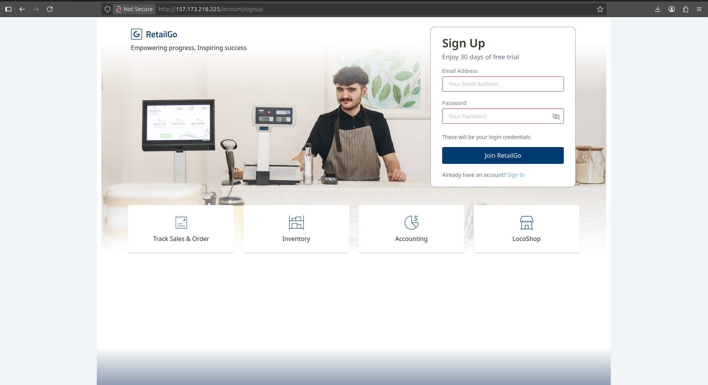

#Laravel App Deployment with Live Database Setup

steps Performed
1. SSH into Remote Server

ssh quickly@157.173.218.225

2. 🗃Navigated to Laravel Project Directory

cd ~/nishat-projects/Retail_Life_Web

3. MySQL: Created & Managed Databases

    Logged into MySQL:

mysql -u fuad_dev -p

Created a temporary database for testing:

CREATE DATABASE demo_db;

Exported full production database rbs_db_live:

mysqldump -u fuad_dev -p rbs_db_live > ~/rbs_db_live_backup.sql

Imported into demo_db:

mysql -u fuad_dev -p demo_db < ~/rbs_db_live_backup.sql

Verified that demo_db has 160+ tables:

    SHOW TABLES;

4. Laravel App Setup

    Created Laravel app directory:

sudo mkdir -p /var/www/laravel-app
sudo cp -r ~/nishat-projects/Retail_Life_Web/* /var/www/laravel-app/

Set correct permissions:

    sudo chown -R www-data:www-data /var/www/laravel-app
    sudo chmod -R 775 /var/www/laravel-app/storage
    sudo chmod -R 775 /var/www/laravel-app/bootstrap/cache

5. ⚙Environment File Configuration

    Added .env file to /var/www/laravel-app/ and updated DB credentials to use demo_db.

    Example snippet from .env:

    DB_DATABASE=demo_db
    DB_USERNAME=fuad_dev
    DB_PASSWORD=your_db_password

6. Laravel Dependencies

    Installed dependencies:

composer install

Cleared/optimized configs:

    php artisan config:clear
    php artisan optimize:clear
    composer dump-autoload

7. Running the Laravel App

    Started the app using:

php artisan serve --host=0.0.0.0 --port=8001

App was accessible at:

    http://157.173.218.225:8001/account/login

8. 🔐 Login Data Verification

    Verified the users table exists in demo_db:

SELECT * FROM users LIMIT 5;

Reset password for a known user to 123456:

UPDATE users SET password = '**' WHERE id = 3;

Outcome

    Laravel application successfully deployed and connected to a live production copy database.

    Login functionality confirmed working.

    Database demo_db contains real data copied from rbs_db_live.
